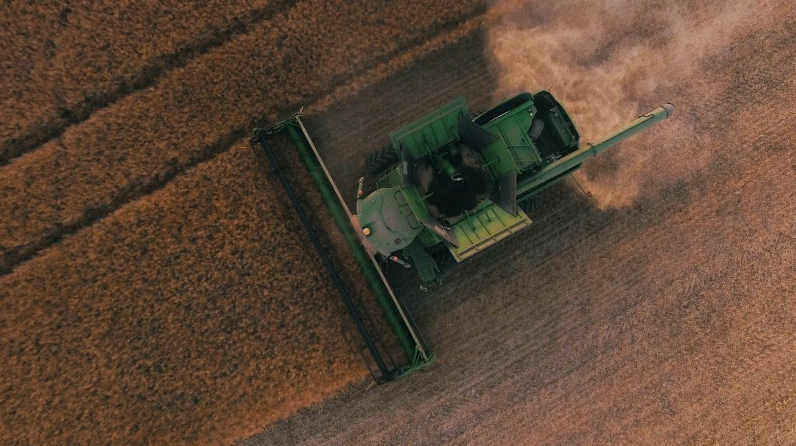
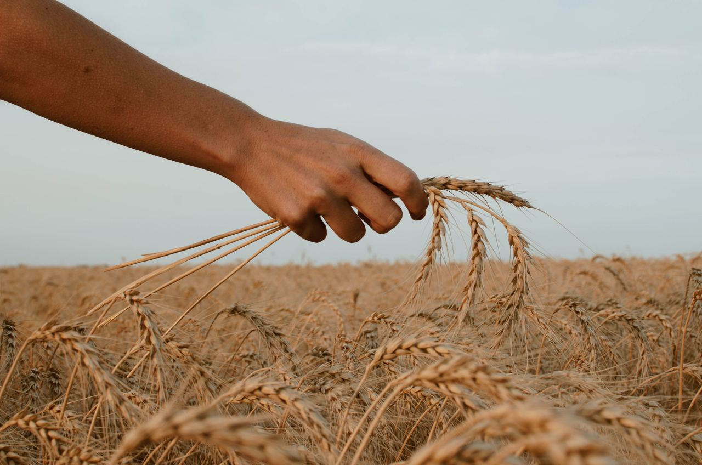

```{r setup, include = FALSE}
knitr::opts_chunk$set(echo = TRUE, warning = FALSE, message = FALSE, fig.align = "center")

library(tidytuesdayR)
library(tidyverse)
library(ggplot2)
library(ggthemes)
library(plotly)
library(viridis)
library(hrbrthemes)
library(gganimate)
library(RColorBrewer)
```

## Global Crop Yield


By
Cynthia Oo , 
Matthias Koh Yong An, 
Raphael Teng Yao Wei, 
Sneha Kumar

## 1. Introduction

**“Hidden inside every soybean is a little world of wonder.”** We chanced upon this message on a packet of the F&N Nutrisoy drink, inspiring us to wonder about our food sources. This led to us selecting the Global Crop Yield dataset from TidyTuesday. As food is a vital resource, our project endeavors to evaluate the condition of our food security by exploring two areas with this dataset. 1) First, we would like to explore the factors that affect crop yield to educate the readers about the challenges of crop production. 2) Thereafter, we will discuss the impact of biofuel, one of the significant sources of energy, on crop yield. These are interesting questions as in a world of scarcity, we are constantly seeking balance and researching on new technology to optimize our resources including food crops. Through this, we hope to enlighten the readers on the challenges faced during food production, create greater appreciation of food and farmers, and generate environmental awareness on the need to live sustainably.

## 2. Data Description
The data comes from Our World in Data, which was taken from the UN Food and Agricultural Organisation (FAO), showing agricultural yield from 1960 onwards.

**The Data sets are as such**:

`key_crop_yields` dataset describes the yearly volume of production tonnes per hectare for selected crops from 1961 to 2018 

`arable_land` dataset describes the land needed to produce a fixed quantity of cereal crops from 1961

`fertilizer` dataset describes the amount of fertilizers used per hectare from 1961

`land_use` dataset describes the percentage change of land used in tons per hectare for crops from 1961 

`tractors` dataset describes the number of tractors used per 100 sqkm from 1961

### 2.1 Reading in Data
```{r reading data}
crop_data_ls = tt_load('2020-09-01')

arable_land = crop_data_ls[[1]]
fertilizer = crop_data_ls[[2]]
tractors = crop_data_ls[[3]]
key_crop_yields = crop_data_ls[[4]]
land_use = crop_data_ls[[5]]
```

### 2.2 Data Cleaning 
#### Renaming columns
We renamed the columns of all 5 datasets to R code-friendly names. We also abbreviated some terms as shown below. 

**Glossary of terms:**

qty - quantity

kgpha - kilogram per hectare area

sqkm - square kilometers

tpha - tonnes per hectare area

```{r renaming columns}
# Arable Land data set
colnames(arable_land) = c("entity", "code", "year","arable_land_fixed_qty")

# Fertilizer data set
colnames(fertilizer) = c("entity", "code", "year", "cereal_yield_tpha", "nitrogen_fertilizer_kgpha")

# Tractors data set
colnames(tractors) = c("entity", "code", "year", "tractors_per_100_sqkm", "cereal_yield", "total_population")

# Key Crop Yields data set
colnames(key_crop_yields) = c("entity", "code", "year", "wheat(tpha)", "rice(tpha)","maize(tpha)","soybeans(tpha)","potatoes(tpha)", "beans(tpha)", "peas(tpha)", "cassava(tpha)","barley(tpha)","cocoa_beans(tpha)","bananas(tpha)")

# Land Use data set
colnames(land_use) = c("entity", "code", "year", "cereal_yield_idx", "land_area_change", "total_population")
```

#### Cleaning Tractor and Land Use
We observed that `tractors` and `land_use` datasets had columns with character type for year column. Thus, we needed to change it to the numeric type. We also filtered the data to the years of 1961 to 2018, which is the time period we are focusing on, and removed observations for which no crop related data is available.

```{r clean: fix year column}
# Cleaning tractor data
tractors = tractors %>%
  filter(!str_detect(year, "BCE")) %>%   # remove BCE columns (no more NAs produced when converting to numeric)
  mutate(year = as.numeric(year)) %>%    # convert year to a numeric data 
  filter(year >= 1961 & year <= 2018) %>% # filter to years between 1961-2018
  filter(!is.na(cereal_yield) | !is.na(tractors_per_100_sqkm))  # filter out observations with no data on both cereal yield and tractors

# Cleaning Land_use data 
land_use = land_use %>%
  filter(!str_detect(year, "BCE")) %>%   # remove BCE columns (no more NAs produced when converting to numeric)
  mutate(year = as.numeric(year)) %>%    # convert year to a numeric data 
  filter(!is.na(cereal_yield_idx) | !is.na(land_area_change)) #filter out observations with no data on both cereal yield index and land area change
```

### 2.3 Descriptive Statistics 
Understanding that applying summary over each of the datasets is not helpful as they contain observations from both regions and countries, we performed data wrangling to produce summary statistics for certain groups. First, to explore the trends of the different factors, we found the medians of each of the factors by year. 

```{r descriptive stats factors}
#Median values across all regions by years for each of the factors: cereal yield, nitrogen fertilizer, tractors, arable land, land area change
fertilizer %>%
  filter(is.na(code)) %>% 
  group_by(year) %>%
  summarize(median_cereal_yield = median(cereal_yield_tpha, na.rm = TRUE), median_nitrogen_fert = median(nitrogen_fertilizer_kgpha, na.rm = TRUE))

tractors %>%
  filter(is.na(code)) %>%
  group_by(year) %>%
  summarize(median_tractors = median(tractors_per_100_sqkm, na.rm = TRUE))

arable_land %>%
  filter(is.na(code))%>%
  group_by(year) %>%
  summarize(median_arable_land = median(arable_land_fixed_qty, na.rm = TRUE))

land_use %>%
  filter(is.na(code))%>%
  group_by(year) %>%
  summarize(median_land_area_change = median(land_area_change, na.rm = TRUE))
```
As seen from the summary tables, the median cereal yield increases approximately 2.3 times over the years from 1961 to 2018, with a steady increase in nearly every year. The median nitrogen fertilizers usage, whose data is provided only from 2002, show more fluctuations but still generally increases from 2002 to 2017 by about 1.4 times. The median tractors usage generally increases by about 46 times from 1961 to 2007. There is no regional data 2008 onwards. The median arable land decreases by about 65% over time. Finally, the median land area increases by about 1.5 times. 

Although these trends generally show that factors such as fertilizer, tractor usage, arable land, and land area may be correlated with cereal yield, it is critical to note that the median values by region may not show the actual world trends. Since some regions have NA values for some of the years, it may result in exaggerated results. This can be especially seen in the change in median tractor usage. Hence, these trends motivate us to further explore the presence of correlation by visualizing the world trends of these factors over the years. 


Next, to explore the trends of yields of the top three biofuel crops, the summary statistics for the key periods before, during, and after the rise of biofuel. The selected years include 1961 (Base/earliest year), 1980 (Few years before biofuel was technology created), 1990 (Shift towards biofuel), 2004 (Boom in adoption of biofuel crops), 2010 (Few years after boom in biofuel) and 2018 (Latest year)

```{r sum stats biofuel}
key_crop_yields %>%
  filter(year == 1961, is.na(code)) %>%  
  select(`maize(tpha)`,`soybeans(tpha)`,`wheat(tpha)`) %>%
  summary()

key_crop_yields %>%
  filter(year == 1980, is.na(code)) %>%
  select(`maize(tpha)`,`soybeans(tpha)`,`wheat(tpha)`) %>%
  summary()

key_crop_yields %>%
  filter(year == 1990, is.na(code)) %>%
  select(`maize(tpha)`,`soybeans(tpha)`,`wheat(tpha)`) %>%
  summary()

key_crop_yields %>%
  filter(year == 2004, is.na(code)) %>%
  select(`maize(tpha)`,`soybeans(tpha)`,`wheat(tpha)`) %>%
  summary()

key_crop_yields %>%
  filter(year == 2010, is.na(code)) %>%
  select(`maize(tpha)`,`soybeans(tpha)`,`wheat(tpha)`) %>%
  summary()

key_crop_yields %>%
  filter(year == 2018, is.na(code)) %>%
  select(`maize(tpha)`,`soybeans(tpha)`,`wheat(tpha)`) %>%
  summary()
```

The summary tables reveal that there is an overall increase in maize, soybeans, and wheat crops over the selected years. However, these statistics do not depict the trends for each region, compelling us to explore into these trends further via visualizations. 


## 3. Question 1 - What factors could affect global crop yield? 


### 3.1 Introduction
To answer this question, we first explore the relationships between global cereal crop yield (includes crops such as rice, wheat, maize, and barley) and factors such as the usage of arable land, nitrogen fertilizers, land use, tractors, and population across the world. Thereafter, we investigate the influence of environmental factors such as drastic weather conditions, as well as international political events that could impact global crop yield and hence affect our world food security.

### 3.2 Methodology
Our first visualization analyzes the relationship between the global cereal yield index and the general global trend for arable land, nitrogen fertilizers, land use, tractors, and population for 1961 to 2018. To aid our visualization, we join the `arable_land`, `fertilizer`, `tractors`, and `land_use` datasets. All factors are converted to a base index of 100 from their respective base years, which are determined by the earliest year for which the data of each of the factors became available. We have chosen a line chart to display the trend between cereal yield index and each factor's index as a time series. More specifically, the x-axis displays the time from 1961 to 2018, the y-axis is the index values (base set at 100), and each factor's trend is represent by a different colored line. The reason for using index is to facilitate the comparison of changes in factors over time.

Our second visualization analyzes the cereal yield trend within each region from our merged dataset, `all_factors`. All regions are analyzed from 1980 to 2018 and selected regions with interesting trends are displayed for further analysis. We have chosen a line chart to conduct a clear time-series analysis. Once again, the x-axis displays the time from 1980 to 2018 and the y-axis displays the index values (base set at 100). We have also faceted the different regions and highlighted the periods with a drop in cereal yield. 

### 3.3 Visualizations 1 
#### 3.3.1 Verifying our keys
We verify that entity and year is our primary key in all data sets, to be used as our key for join. Then, we join the datasets using that key.
```{r join data all factors}
fertilizer %>% 
  count(entity, year) %>%
  filter(n > 1)

arable_land %>%
  count(entity, year) %>%
  filter(n > 1)

tractors %>%
  count(entity, year) %>%
  filter(n > 1)

land_use %>%
  count(entity, year) %>%
  filter(n > 1)

fert_arable = full_join(fertilizer, arable_land)
fert_arable_landuse = full_join(fert_arable, land_use)
all_factors = full_join(fert_arable_landuse, tractors)
```

#### 3.3.2 Indexing values
Now, we will compute all index values for all factors - nitrogen, tractors, population, arable land
```{r compute index all factors world}

# extract observations for World from all_factors
all_factors_world = filter(all_factors, entity == "World")

# Nitrogen fertilizer base year - 2002 (up to 2014)
base_year_fert = all_factors_world %>%
  filter(!is.na(nitrogen_fertilizer_kgpha)) %>%
  summarize(min_year = min(year), nitrogen_fertilizer_kgpha) %>%
  head(n = 1)   

# Tractors base year - 1961 (gap between 1988-1991) 
base_year_tractor = all_factors_world %>%
  filter(!is.na(tractors_per_100_sqkm)) %>%
  summarize(min_year = min(year), tractors_per_100_sqkm) %>%
  head(n = 1)   

# Population base index
base_year_population = all_factors_world %>%
  filter(!is.na(total_population)) %>%
  summarise(min_year = min(year), total_population) %>%
  head(n = 1)

# We realize that cereal_yield_idx is derived from cereal_yield, which has NA values for 2015-2018. Since, the cereal_yield_tpha has data available for 2015-2018, we decided to calculate cereal yield index via cereal_yield_tpha to get a more complete picture. 
all_factors_world %>%
  select(cereal_yield_tpha, cereal_yield_idx)

# We fill in the missing data manually by using cereal_yield_tpha
# 1. Extract base cereal yield value
base_cereal_yield_val = all_factors_world %>%
  filter(year == 1961) %>%
  select(cereal_yield_tpha) %>%
  as.numeric()

base_cereal_yield_val2 = all_factors_world %>%
  filter(year == 1961) %>%
  select(cereal_yield) %>%
  as.numeric()

# 2. Fill in the missing data
all_factors_world = all_factors_world %>%
  mutate(cereal_yield_tpha_index = cereal_yield_tpha/base_cereal_yield_val*100, 
         cereal_yield_agg_index = cereal_yield/base_cereal_yield_val2*100)

all_factors_world %>%
  select(year,cereal_yield_idx, cereal_yield_tpha_index, cereal_yield_agg_index)

# We calculate index value for other columns
all_factors_world_index = all_factors_world %>%
  mutate(arable_land_index = arable_land_fixed_qty * 100, 
         nitrogen_fertilizer_index = nitrogen_fertilizer_kgpha/base_year_fert$nitrogen_fertilizer_kgpha*100, 
         tractors_index = tractors_per_100_sqkm/base_year_tractor$tractors_per_100_sqkm*100,
         population_index = total_population/base_year_population$total_population*100)
```

#### 3.3.3 Plotting the graph
```{r world index plot, warning = FALSE}
p1 = ggplot(all_factors_world_index, aes(x = year)) +
  geom_path(aes(y = cereal_yield_tpha_index), color = "firebrick4") +
  geom_path(aes(y = land_area_change), color = "blue4") +
  geom_path(aes(y = arable_land_index), color = "darkorchid4") +
  geom_path(aes(y = tractors_index), color = "springgreen4") +
  geom_path(aes(y = nitrogen_fertilizer_index), color = "darkorange4") +
  geom_path(aes(y = population_index), color = "deeppink4") +
  geom_point(aes(y = cereal_yield_tpha_index), color = "firebrick3") +
  geom_point(aes(y = land_area_change), color = "blue") +
  geom_point(aes(y = arable_land_index), color = "darkorchid1") +
  geom_point(aes(y = tractors_index), color = "springgreen3") +
  geom_point(aes(y = nitrogen_fertilizer_index), color = "darkorange2") +
  geom_point(aes(y = population_index), color = "deeppink1") +
  geom_hline(yintercept = 100, color = "black") +
  annotate("text", label = "Cereal Yield", x = 2012 ,y = 300, vjust = 0, hjust = 0.5, size = I(3), color = "firebrick3") +
  annotate("text", label = "Land Area Change", x = 2015 ,y=105, vjust = 0.4
           , hjust = 0.5, size = I(3), color = "blue") +
  annotate("text", label = "Arable Land", x = 2014 ,y = 45, vjust = 0.5, hjust = 0.5, size = I(3), color = "darkorchid1") +
  annotate("text", label = "Tractors", x = 1988 ,y = 215, vjust = 0, hjust = 1, size = I(3), color = "springgreen3") +
  annotate("text", label = "Population", x = 2016 ,y = 252, vjust = 0.5, hjust = 0.7, size = I(3), color = "deeppink1") +
  annotate("text", label = "Nitrogen Fertilizer", x = 2015 ,y = 138, vjust = 0.5, hjust = 0.5, size = I(3), color = "darkorange2") +
  ggtitle("Change in Factors Index Worldwide From 1961 to 2018", subtitle=("Cereal yield, population, tractors, arable land and land use figures are indexed to 1961. Nitrogen fertilizer figure is indexed to 2002. ")) +
  xlab("Year") +
  ylab("Index") +
  scale_x_continuous(breaks = seq(1960,2020,10)) +
  theme_bw() +
  theme(
    plot.title = element_text(size = 12, face = "bold.italic", hjust = 0),
    plot.subtitle = element_text(size = 8, face = "italic", hjust = 0),
    axis.title.x = element_text( size = 10, face = "bold"),
    axis.title.y = element_text( size = 10, face = "bold")) 

p1

```

### 3.3.4 Discussion 1 
We can see that cereal yield (red) has a general upward trend from 1961 to 2018. This seems to be in tandem with the increasing trend of both tractors usage (green) before 2000 and the nitrogen fertilizers usage (orange) after 2002. Greater use of tractors, which could reduce labor, increases productivity and hence the cereal yield. Similarly, nitrogen fertilizers allow crops to grow faster and bigger, leading to increased cereal yields. 

Population (pink) increases consistently over the time period. This suggests that a greater population would result in greater demand for food, hence creating greater need for increased production of crops, including cereal crops. 

Land area change (blue) refers to the amount of land used to produce cereal crops from 1961. As shown by the trend, the amount of land used to grow cereal crops worldwide overall remains relatively unchanged, with only a slight increase. On the other hand, the arable land index needed to produce a fixed amount of crop (purple) decreases, meaning that over time, less land is needed to produce the same amount of cereal crop. 

All in all, it can be deduced that productivity to produce cereal yield has increased over time. While the cereal yield index doubled from 1961 to 1990, the land area index remained relatively constant, but the arable land index decreased by half. This implies that over the years more crops can be grown on the same amount of land, indicating an increase the productivity of cereal yield production. The rise in population could have further pressured to explore ways to increase the cereal yield productivity. Some of the factors that could have boosted the cereal yield productivity include the increase of tractor usage before 2000s as well as the introduction of nitrogen fertilizers in the 2000s. 

A notable observation from the plot is that although cereal yield generally increased overtime, it fluctuated year-to-year despite the stable increase or decrease in other factors. This implies that cereal yield could be potentially affected by other components, which will be explored in visualization 2.  

### 3.4 Visualisation 2
#### Cereal Yield affected by enivronmental and politcial factors in selected regions from 1980
#### 3.4.1 Plotting the graph
```{r facet by region}
all_factors %>%
  filter(entity %in% c("Asia, Central","Europe, Western","Northern America", 
                      "South America","Southern Africa")) %>%
  filter(year >= 1980) %>%
  ggplot(aes(x = year, y = cereal_yield_tpha)) +
  geom_path(color = "firebrick4") +
  ggtitle("Change in Factors Index by Region From 1980 to 2018") +
  xlab("Year") +
  ylab("Cereal Yield (tons per hectare)") +
  geom_rect(data = data.frame(entity = "Asia, Central"), aes(xmin = 1992, xmax = 1996, ymin = 0, ymax = Inf), alpha = 0.2, fill = "blue", inherit.aes = FALSE) +
   geom_rect(data = data.frame(entity = "Europe, Western"), aes(xmin = 2002, xmax = 2004, ymin = 0, ymax = Inf), alpha = 0.2, fill="blue", inherit.aes = FALSE) +
   geom_rect(data = data.frame(entity = "Northern America"), aes(xmin = 2010, xmax = 2013, ymin = 0, ymax = Inf), alpha = 0.2, fill="blue", inherit.aes = FALSE)+
   geom_rect(data = data.frame(entity = "South America"), aes(xmin = 2008, xmax = 2011, ymin = 0, ymax = Inf), alpha = 0.2, fill="blue", inherit.aes = FALSE) +
   geom_rect(data = data.frame(entity = "Southern Africa"), aes(xmin = 1998, xmax = 2000, ymin = 0, ymax = Inf), alpha = 0.2, fill="blue", inherit.aes = FALSE) +
   geom_rect(data = data.frame(entity = "Southern Africa"), aes(xmin = 2014, xmax = 2016, ymin = 0, ymax = Inf), alpha = 0.2, fill="blue", inherit.aes = FALSE) +
  geom_rect(data = data.frame(entity = "Southern Africa"), aes(xmin = 1980, xmax = 1985, ymin = 0, ymax = Inf), alpha = 0.2, fill="blue", inherit.aes = FALSE) +
  geom_rect(data = data.frame(entity = "Southern Africa"), aes(xmin = 1990, xmax = 1996, ymin = 0, ymax = Inf), alpha = 0.2, fill="blue", inherit.aes = FALSE) +
  theme_bw() +
  theme(
    plot.title = element_text(size = 12, face = "bold.italic", hjust = 0),
    axis.title.x = element_text(size = 10, face = "bold"),
    axis.title.y = element_text(size = 10, face = "bold")) +
  facet_wrap(~entity, scales = "free") +
  scale_x_continuous(limits = c(1980, 2020)) + scale_y_continuous(limits = c(0, 8))

```

### 3.4.2 Discussion 2
For this analysis, we have focused on the highlighted parts which depict interesting dips in cereal yield for a region suggesting that there may be other underlying factors.

For 'Asia, Central', we can see there was a drop from 1992 to 1995. This could be due to the disbandment of the United Socialist Soviet Republic (USSR) in 1991, which also explains why the data collection for Central Asia Countries only started in 1992. As smaller independent countries emerged, water allocations and rights had to be decentralized, causing disagreements in water supply amongst the affected countries. With less water available for irrigation, fewer crops were grown, resulting in a gradual prolonged fall in cereal yield over the period.

For 'Europe, Western', we have noticed a dramatic drop in cereal yield in 2003. This could be attributed to the extreme heatwave and drought that strucked the region in 2003, which was said to be the hottest summer on record since 1540. France, a country in Western Europe, was hit the hardest, with the highest regional wheat yield losses of greater than 1.5 tpha in the east of France alone. Thus, the extreme weather caused crops to wither and die which resulted in declining cereal yield. 

For 'Northern America', there was a steep decline in 2012. This could arise from the historic drought conditions in 2012 that affected most of the Midwest region of the United States of America (USA), the agricultural hub. Cereal crops were the most affected, with an estimated decrease of 17% from 2011 demonstrating the harsh impact of the drought. 

For 'Southern America', there was a slight drop in 2009. Based on further research, we discovered this decrease was caused by the persistent dry weather since 2008. This led to the decrease in crop yields across several South American countries. For instance, Argentina experienced an astounding decrease of 50% in its wheat yield. 

For 'Southern Africa', fluctuations were observed over multiple time periods as shown by the highlighted areas on the plot. From 1980 to 1997, Southern Africa experienced extreme heatwave and drought, while from 1998 to 1999 it was affected by extreme rain conditions. More specifically, Southern Africa experienced relatively low production due to both abiotic (such as drought and heat) and biotic (such as microorganisms that feed on crops) factors. Additionally, over the period of 1980-1990s, the World Bank and other donors were reluctant to invest in irrigation in Southern Africa due to its history of underperforming infrastructure, which further hindered Southern Africa from advancing its agricultural technology. 
Furthermore, in 2015, Southern Africa experienced erratic weather conditions such as late start of seasonal rains followed by heavy rains that caused flooding in parts of some countries only to be worsened by a long dry spell thereafter. All of these extreme weather changes and political events affected the productivity of crop yield and hence could account for the decline in crop yield. 

### 3.4.3 Conclusion Question 1
In conclusion, factors such as arable land, nitrogen fertilizers, land use, tractors, and population play a role in influencing the rise in cereal yield production and productivity. In addition to these factors, political instability could cause supply shocks and hence affect the inputs of cereal production, and thus impacting the cereal yield. Furthermore, environmental factors like extreme weather droughts or excessive rain can negatively affect cereal crop yield. This depicts the challenges farmers face in order to produce food to sustain the world. Moreover, it shows that global warming caused by human activities has increased the intensity of unpredictable weather, making it even more difficult to produce agricultural crops. Hence, if we, as humans, do not make efforts to change our unsustainable ways, we could face even worse food shortages than what we are already facing today, thereby escalating food prices even further. 

## 4. Question 2 Did the influence of biofuel affect the crop yield?


### 4.1 Introduction
Maize, wheat and soybean are three types of biofuel crops commonly used around the world. Maize and wheat produce bioethanol while soybean is used for the production of biodiesel. The trends of these crops are explored using the `key_crop_yield` dataset. Since resources are scarce, it is interesting to see how some regions choose to produce more crops for biofuel instead of food consumption in order to generate more income.

### 4.2 Methodology
As wheat, maize and soybeans are the main feedstock for biofuels, they are chosen for visualization 1. A line representing the mean crop yield of other non-biofuel crops (potatoes, bananas, rice, etc.) is added in the graph as a control. This reveals that while other crop yields generally increased over time due to productivity, the wheat, maize and soybean crops experience a steeper increase which could be due to the rise in demand for biofuel crops. To investigate further, we conducted a time-series analysis of the total yield tons per hectare for all three crops distinguished by colors; the x-axis represents time from 1961 to 2018 and the y-axis displays the yield index with the base year of 1961 indexed to 0. We added two reference lines on 1990 and 2004. 1990 is the year when countries started shifting towards producing biofuel and 2004 is the year when there was a higher demand for biofuel. These reference lines help the reader to see a clear distinction of the boom in biofuel. 

For visualisation 2, we narrow down to focus on maize yield as it showed the greatest increase in yield among all the biofuel crops from visualization 1. This is supported by the fact that maize is the most popular crop used in biofuel production. The observations for maize yield are filtered out by regions. While exploring the data, we discovered that some regions had missing data. However, we could only recover the data for the Belgium-Luxembourg region. Since Belgium's and Luxembourg's data were also spilt into their respective countries after 2000, we took the mean of the individual data from 2000 onwards to fill up the missing data. To effectively display the time series data for each region as well as to determine the changes on maize crop yield during the introduction and boom of biofuels, a heatmap was selected. The x-axis represents the timeline from 1961 to 2018, with reference lines at 1990 and 2004, while the y-axis represents the regions. A color gradient is used to display the increase in maize yield, where the darker color indicates higher maize yield.

### 4.3 Visualisation 1
#### 4.3.1 Retrieving Specific Data and Tidy Data
```{r}
# Getting the mean crop yield of crops other than wheat, maize and soybean
key_crop_yields_all =  key_crop_yields %>%
  filter(entity == "World") %>% 
  rowwise() %>%
  mutate(`other_crops(tpha)` = mean(c(`potatoes(tpha)`,
                                      `cassava(tpha)`,
                                      `bananas(tpha)`, 
                                      `rice(tpha)`, 
                                      `beans(tpha)`,
                                      `peas(tpha)`,
                                      `barley(tpha)`,
                                      `cocoa_beans(tpha)`)))%>%
  select(entity, code, year, `wheat(tpha)`, `maize(tpha)`,`soybeans(tpha)`, `other_crops(tpha)`)

#Tidying the data
crop_data_u = key_crop_yields_all %>%
  gather('wheat(tpha)':'other_crops(tpha)', key = "crops", value = "yield(tpha)")

# Retrieving base year for each country
base_year_key_crop = crop_data_u %>%
  group_by(crops) %>%
  mutate(min_year = min(year)) %>%
  filter(year == 1961)

# Indexing each country based on their base year crop yield tpha
crop_data_u_index = crop_data_u %>%
  mutate(yield_tpha_idx = 
           case_when( 
             crops == "wheat(tpha)" ~ (`yield(tpha)`/base_year_key_crop$`yield(tpha)`[1])-1,
             crops == "maize(tpha)" ~ (`yield(tpha)`/base_year_key_crop$`yield(tpha)`[2])-1,
             crops == "soybeans(tpha)" ~ (`yield(tpha)`/base_year_key_crop$`yield(tpha)`[3])-1,
             crops == "other_crops(tpha)" ~ (`yield(tpha)`/base_year_key_crop$`yield(tpha)`[4])-1))

#renaming crop names for legend 
crop_data_u_index = crop_data_u_index %>%
  mutate(crops = 
           case_when( 
             crops == "wheat(tpha)" ~ "Wheat",
             crops == "maize(tpha)" ~ "Maize",
              crops == "soybeans(tpha)" ~ "Soybeans",
             crops == "other_crops(tpha)" ~ "Other_crops"))
```

#### 4.3.2 Plotting the graph
```{r}
p = ggplot(crop_data_u_index, aes(x = year, y = `yield_tpha_idx`, color = crops)) +
  geom_point(aes(text = paste(crops,'<br>Year:', year, '<br>Crop Yield Index:', round(yield_tpha_idx,2)))) +
  geom_smooth(aes(x = year, y = `yield_tpha_idx`), method="loess", se=FALSE)+
  scale_color_manual(values = c("#E7B800","deeppink1","#00AFBB","limegreen") , name = "Crops") +
  geom_vline(xintercept = 1990, alpha = 0.4, color = "purple", lty=2) +
  geom_vline(xintercept = 2004, alpha = 0.4, color = "red", lty=2) +
  xlab("Year") +
  ylab("Crop Yield Index") +
  ggtitle("Crop Yield Index From 1961 to 2018 (Base year = 1961)") +
  theme_bw() +
  theme(plot.title = element_text(size = 12, face = "bold.italic", hjust = 0),
        axis.title.x = element_text(size = 10, face = "bold"),
        axis.title.y = element_text(size = 10, face = "bold"),
        legend.position = "right", legend.direction = "vertical",
        legend.title = element_text(colour = "Black", face = "bold"),
        legend.margin = margin(grid::unit(0, "cm")),
        legend.text = element_text(colour = "grey40", size = 7, face = "bold"),
        legend.key.height = grid::unit(0.8, "cm"),
        legend.key.width = grid::unit(0.2, "cm")) +
  annotate("text", label="Wheat", x = 2012, y = 2.15, vjust = 1, hjust = 0, size = I(2.7), color = "limegreen")  +
  annotate("text", label = "Maize", x = 2017, y = 1.8, vjust = 1, hjust = 0, size = I(2.7), color ="#E7B800" ) +
  annotate("text", label="Soybeans", x = 2017, y = 1.25, vjust = 1, hjust = 0, size = I(2.7), color ="#00AFBB")  +
  annotate("text", label = "Other crops", x = 2017, y = 0.7, vjust = 1, hjust = 0, size = I(2.7), color ="deeppink1") + 
  annotate("text", label = "1990 : Shift to Biofuels", x = 1982, y = 2.4, vjust = 1, hjust = 0, size = I(2.5), color = "purple") +
  annotate("text", label = "2004 : Boom of Biofuels", x = 2012, y = 2.4, vjust = 1, hjust = 0, size = I(2.5), color="red")
 
cplot = ggplotly(p, tooltip = c("text"))

# For proper formatting of legend names in ggplotly
for (i in 1:length(cplot$x$data)){
    if (!is.null(cplot$x$data[[i]]$name)){
        cplot$x$data[[i]]$name =  gsub("\\(","",str_split(cplot$x$data[[i]]$name,",")[[1]][1])
         cplot$x$data[[i]]$name =  gsub("\\)","",str_split(cplot$x$data[[i]]$name,",")[[1]][1])
    }
}

cplot

```

### 4.3.3 Discussion 1
Overall the graph showcases that all crops yields had gradually increased through the years most likely due to increase in productivity via better farming methods as discussed in Q1. We can also see that the increase in biofuel crops of maize (yellow), soybeans (blue) and wheat (green) occured at a faster rate with a steeper curve than the mean index yield of other crops (pink). This seems to suggest that other factors on top of the increase in productivity could have caused this steeper increase. One such reason is due to the rise of biofuels and thus resulted in greater demand for biofuel crops. 

In 1990, we can see that there was a gradual increase in yield of all three crops (in green, yellow, blue) which extended all the way till 2004. This is in contrast with the other crops (in pink, excluding maize, soybean and wheat) that experienced a gentler increase. A reason for this could be the pivot towards biofuel technology in 1990 which was a novel way of producing energy from crops. However, the increase was gradual probably due to the farmer's hesitancy to adopt higher production of biofuel crops when biofuel was still in its infant stage. 

From 2004 on the other hand, we can see that the increase in crop yield for the three crops is much steeper, widening the gap between the three biofuel crops and other crops. The increase demand of these crops could be attributed to the boom of biofuels in 2004. This is in conjunction with research that showing that biofuels grew into prominence in 2004 to 2010. Hence we can see that apart from the increase due to productivity, the boom of biofuels have also contributed to the steeper increase in crop yield of the top 3 biofuel crops.

### 4.4 Visualisation 2
#### 4.4.1 Split into region and countries 
```{r}
key_crop_yields_region = key_crop_yields %>%
  filter(is.na(code))

key_crop_yields_countries = key_crop_yields %>%
  filter(!is.na(code))
```

#### 4.4.2 Solving Belgium-Luxembourg's Missing data
While cleaning the data, we discovered that for the region Belgium-Luxembourg, it had missing data from the year 2000 onwards. Thus, we retrieved the missing data by getting the aggregate mean of crop yields from the countries data for Belgium and Luxembourg.
```{r }
BelLux = key_crop_yields_countries %>%
  filter(!is.na(`maize(tpha)`)) %>%
  filter(entity %in% c("Belgium","Luxembourg")) %>%
  select(entity, code , year, `maize(tpha)`) %>%
  group_by(year) %>%
  mutate(`maize(tpha)` = sum(`maize(tpha)`/2)) %>%
  filter(entity == "Belgium") %>%
  mutate(entity = "Belgium-Luxembourg", code = NA)
  
key_crop_yields_region_update = full_join(key_crop_yields_region, BelLux)
```

#### 4.4.3 Key Regions for Maize
```{r}
key_crop_yields_region_update2 = key_crop_yields_region_update %>%
  # convert state to factor and reverse order of levels
  mutate(entity=factor(entity, levels=rev(sort(unique(entity))))) %>%
  # create a new variable from maize
  mutate(maizefactor = cut(`maize(tpha)`, 
                           breaks=c(-1, 0, 3, 6, 9, 12, max(`maize(tpha)`, na.rm=T)),
                          labels=c("0", "0-3", "3-6", "6-9", "9-12", ">12"))) %>%
  # change level order
  mutate(maizefactor=factor(as.character(maizefactor), levels=rev(levels(maizefactor))))
```

#### 4.4.4 Plotting the Graph
```{r }
# further modified ggplot
key_crop_yields_region_update2%>%
  filter(!entity %in% c("Ethiopia PDR", "Pacific Islands Trust Territory"))%>%  #filtered out due to NA values
ggplot( aes(x = factor(year), y = entity, fill = maizefactor)) +
  geom_tile(colour = "white", size = 0.2) +
  geom_segment(aes(x = as.factor(1990), xend = as.factor(1990), y = 0, yend = 33.6), color = "purple") +
  geom_segment(aes(x = as.factor(2004), xend = as.factor(2004), y = 0, yend = 33.6), color = "red") +
  guides( fill = guide_legend(title = "Maize yield tpha")) +
  labs(x = "", y = "", title="Maize production rise by Biofuels") +
  scale_y_discrete(expand = c(0, 0)) +
  scale_x_discrete(expand = c(0, 0), breaks = c("1961", "1970", "1980", "1990", "2000", "2010", "2018")) +
  scale_fill_manual( values = rev(brewer.pal(6, "YlGnBu")), na.value = "grey90") +
  theme_grey(base_size = 10) +
  theme(legend.position = "right", legend.direction = "vertical",
        legend.title = element_text(colour = "Black", face = "bold"),
        legend.margin = margin(grid::unit(0, "cm")),
        legend.text = element_text(colour = "grey40", size = 7, face = "bold"),
        legend.key.height = grid::unit(0.8, "cm"),
        legend.key.width = grid::unit(0.2, "cm"),
        plot.background = element_blank(),
        panel.border = element_blank(),
        panel.grid.major = element_blank(),
        panel.grid.minor = element_blank(),
        plot.margin = margin(0.7, 0.4, 0.1, 0.2, "cm"),
        plot.title = element_text(colour = "Black", hjust = 0, size = 14, face = "bold")
      ) +
   annotate("text", label="Shift = 1990", x = as.factor(1990), y = 34.4, 
           vjust = 1, hjust = 0.4, size = I(2.7)) +
  annotate("text", label = "Boom = 2004", x = as.factor(2004), y = 34.4, 
           vjust = 1, hjust = 0.4, size = I(2.7))
```


### 4.4.5 Discussion 2 
Based on the heatmap, there seems to be a slight uptick in maize crop production in 1990s due to the shift towards the adoption of biofuel. Generally, in 2004, more regions experience a greater increase in the maize production. More specifically, we can clearly identify that Northern America's maize yield drastically increased after the biofuel boom in 2004 (red vertical line). From further research, it is found that the United States of America (USA) is the biggest producer of biofuel produced from maize, which supports the trend seen in the graph.

Additionally, all of European Union (Northern, Southern, Eastern and Western Europe) also experienced an increase in maize yield after 2004, especially for Western Europe. This could be attributed by the fact that European Union countries also use maize to produce biofuel. However, since the European Union also uses wheat and soybean crops to produce biofuels, their maize production did not seem to have increased as much in comparison to the Northern America. A reason for this is the fact that the USA is the largest producer of biofuel especially from maize.

### 4.4.6 Conclusion Question 2
In conclusion, we can see that the rise of biofuel adoption especially from the year 2004 onwards had boosted the yields of the top biofuel crop, maize, in regions that produce biofuel. A reason for this boom could be the attractive monetary gains for farmer in biofuel producing regions to switch their crops from other food crops to biofuel crops. Furthermore, such rise in biofuel crop production could be attributed to the increase in demand from biofuel manufacturing companies. Thus, while this switch does affect food security, greater research into the manufacturing of biofuels in recent years has allowed companies using residual and waste products from industry and households to produce biofuels instead. Hence, eventually, biofuels could provide a cleaner sustainable source of energy without competing with the resources for food.

## 5. Overall Conclusion
Food is scarce and is a precious resource that comes as the result of hard work from farmers around the world. From our discussions above, we can see that the world's food security is constantly and easily threatened by environmental factors, human activities and competing uses for other important resources such as energy from biofuels. However, with greater human efforts in research for productivity and sustainability, the world's food security can be improved in future. Thus, while we try to strike a balance, we, as individuals should also play our part to be conscious of our food sources, learn to live more sustainably, and never take for granted the plethora of produce stacked for us on the supermarket shelves.

## 6. Reference
1. Nutrisoy’s tagline https://www.nutrisoy.com.sg/our-story/ 
2. TidyTuesday Project https://github.com/rfordatascience/tidytuesday/blob/master/data/2020/2020-09-01/readme.md  
3. Tractors boost productivity https://www.bearflagrobotics.com/blog/enhance-agricultural-productivity/ 
4. Disbandment of USSR https://history.state.gov/milestones/1989-1992/collapse-soviet-union 
5. Asia, Central water disagreement https://publications.iwmi.org/pdf/H035768.pdf
6. Europe heatwave https://www.unisdr.org/files/1145_ewheatwave.en.pdf
7. Northern America drought https://www.nass.usda.gov/Newsroom/archive/2013/01_11_2013.php
8. Southern America dry weather https://news.un.org/en/story/2009/02/290902-un-predicts-fall-global-cereal-production-record-numbers-go-hungry
9. Southern Africa 1980 to 1997 drought https://www.nature.com/articles/s41467-020-18317-8
10. Southern Africa 1998 to 1999 rain https://reliefweb.int/report/angola/fews-special-report-southern-africa-cereal-availability-update-99-2
11. Southern Africa 2015 weather conditions https://reliefweb.int/report/zimbabwe/giews-update-southern-africa-maize-production-2015-expected-drop-sharply
12. Biofuel’s History https://farm-energy.extension.org/history-of-biodiesel/ 
13. USA & European Union biofuel production (page 200) https://www.oecd-ilibrary.org/docserver/1112c23b-en.pdf?expires=1649903232&id=id&accname=guest&checksum=467FD5C4B5A26BF7EEFB7D14F62A5B1C 
